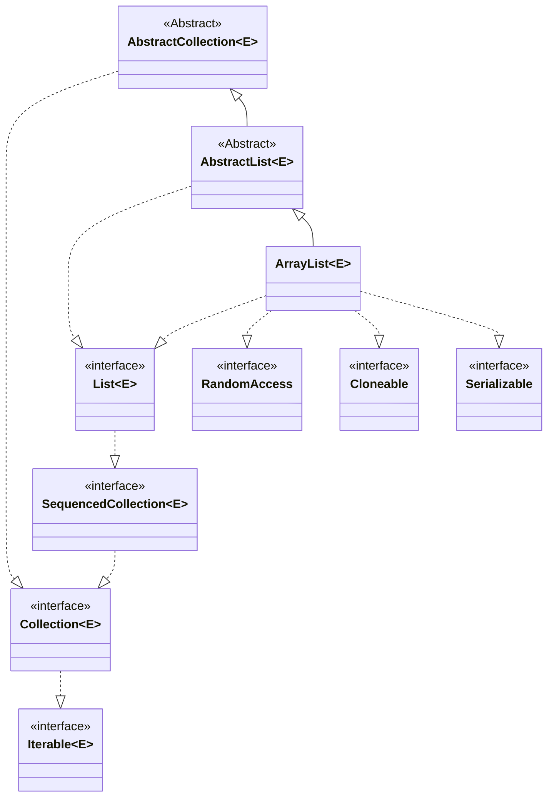

# インターフェース

# メソッド

* `ArrayList<E>`
    * `Object clone()`
    * `void ensureCapacity(int minCapacity)`
    * `void trimToSize()`
* `List<E>`
    * `static <E> List<E> copyOf(Collection<? extends E> coll)`
    * `static <E> List<E> of()`
    * `static <E> List<E> of(E e1)`
    * `static <E> List<E> of(E... elements)`
    * `static <E> List<E> of(E e1, E e2)`
    * `static <E> List<E> of(E e1, E e2, E e3)`
    * `static <E> List<E> of(E e1, E e2, E e3, E e4)`
    * `static <E> List<E> of(E e1, E e2, E e3, E e4, E e5)`
    * `static <E> List<E> of(E e1, E e2, E e3, E e4, E e5, E e6)`
    * `static <E> List<E> of(E e1, E e2, E e3, E e4, E e5, E e6, E e7)`
    * `static <E> List<E> of(E e1, E e2, E e3, E e4, E e5, E e6, E e7, E e8)`
    * `static <E> List<E> of(E e1, E e2, E e3, E e4, E e5, E e6, E e7, E e8, E e9)`
    * `static <E> List<E> of(E e1, E e2, E e3, E e4, E e5, E e6, E e7, E e8, E e9, E e10)`
    * `void add(int index, E element)`
    * `boolean addAll(int index, Collection<? extends E> c)`
    * `void clear()`
    * `E get(int index)`
    * `int hashCode()`
    * `int indexOf(Object o)`
    * `Iterator<E> iterator()`
    * `int lastIndexOf(Object o)`
    * `ListIterator<E> listIterator()`
    * `ListIterator<E> listIterator(int index)`
    * `E remove(int index)`
    * `E set(int index, E element)`
    * `int size()`
    * `List<E> subList(int fromIndex, int toIndex)`
    * `default void replaceAll(UnaryOperator<E> operator)`
    * `default List<E> reversed()`
    * `default void sort(Comparator<? super E> c)`
* `SequencedCollection<E>`
    * `SequencedCollection<E> reversed()`
    * `default void addFirst(E e)`
    * `default void addLast(E e)`
    * `default E getFirst()`
    * `default E getLast()`
    * `default E removeFirst()`
    * `default E removeLast()`
* `Collection<E>`
    * `boolean add(E e)`
    * `boolean addAll(Collection<? extends E> c)`
    * `void clear()`
    * `boolean contains(Object o)`
    * `boolean containsAll(Collection<?> c)`
    * `boolean equals(Object o)`
    * `int hashCode()`
    * `boolean isEmpty()`
    * `Iterator<E> iterator()`
    * `boolean remove(Object o)`
    * `boolean removeAll(Collection<?> c)`
    * `boolean retainAll(Collection<?> c)`
    * `int size()`
    * `Object[] toArray()`
    * `<T> T[] toArray(T[] a)`
    * `default Stream<E> parallelStream()`
    * `default boolean removeIf(Predicate<? super E> filter)`
    * `default Stream<E> stream()`
    * `default <T> T[] toArray(IntFunction<T[]> generator)`
* `Iterable<E>`
    * `Iterator<T> iterator()`
    * `default void forEach(Consumer<? super T> action)`
    * `default Spliterator<T> spliterator()`